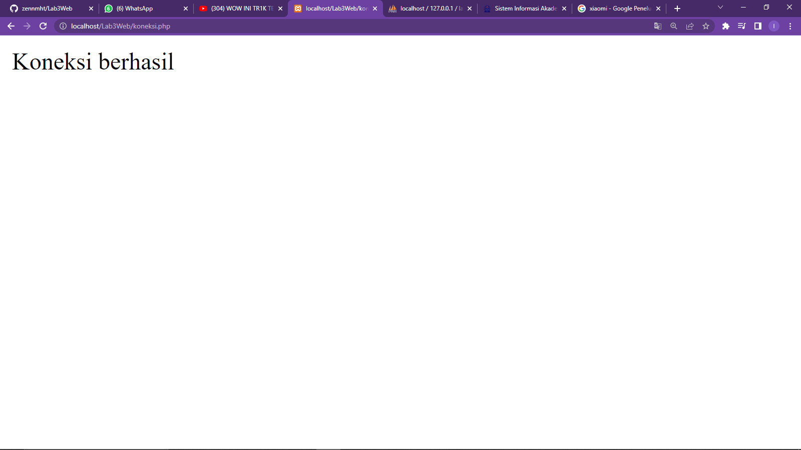
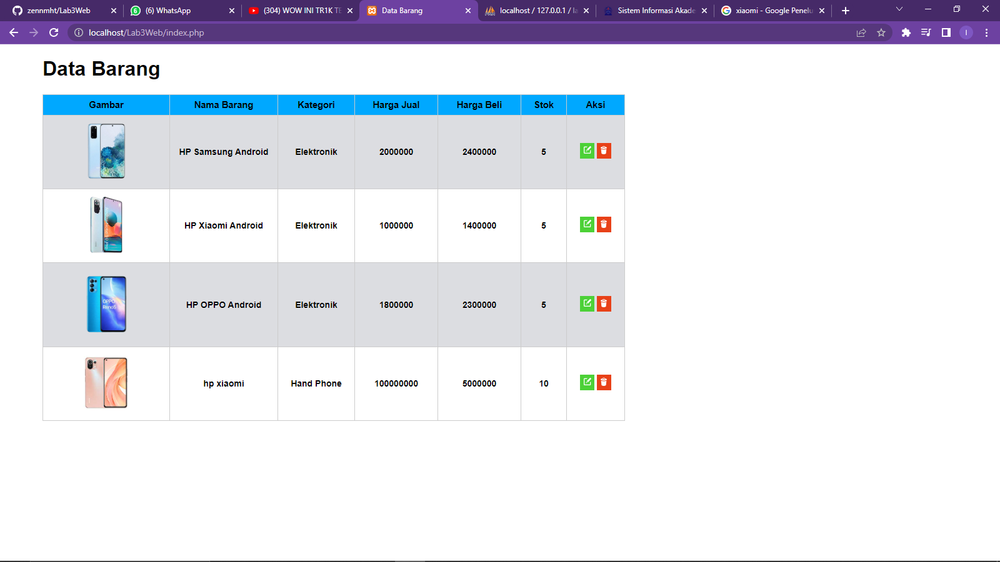
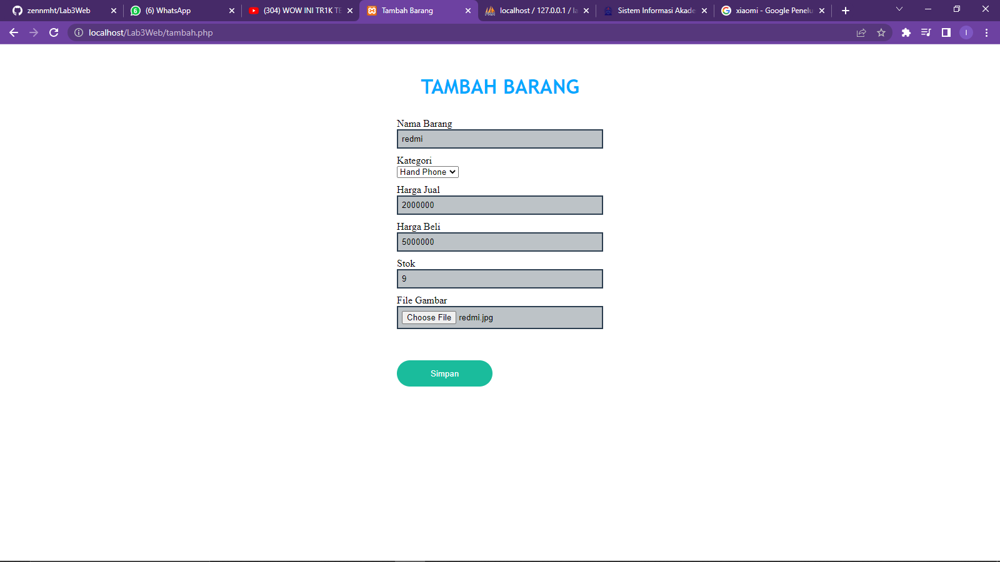
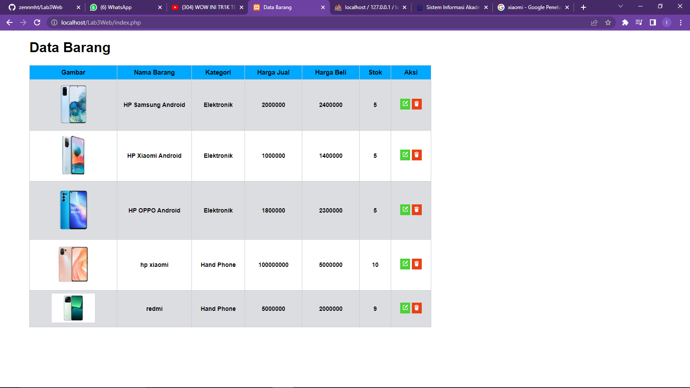
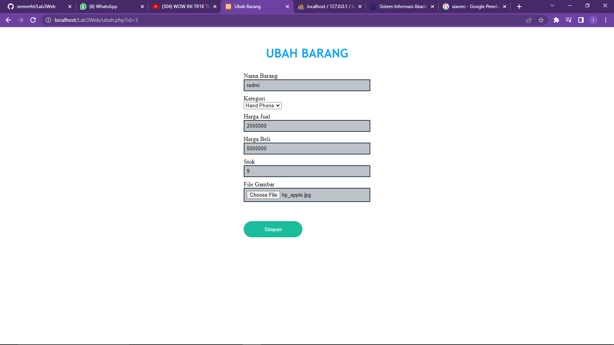

# TUGAS Lab3 PHP Database Pemograman Web 2

***NAMA : IRFAN FADLURRAHMAN***  
***NIM : 312110465***  
***KELAS : TI.21.A3***  

### **hasil file koneksi.php**

  

### **Penjelasan**
>Hasil diatas merupakan tampilan yaitu menghubungkan Table PHP dengan MYSQL Database PHPMYADMIN

### **hasil file index.php**

  

### **Penjelasan**
>Hasil diatas merupakan tampilan yaitu Table HTML dengan menggunakan Database PHP

### **hasil file tambah.php**

  

### **hasil output tambah.php**

  

### **Penjelasan**
>Hasil diatas merupakan tampilan yaitu untuk menambahkan barang ke Database PHP

### **hasil file ubah.php**

  

### **Penjelasan**
>Hasil diatas merupakan tampilan yaitu untuk mengubah barang ke Database PHP

### **hasil file hapus.php**

  

### **Penjelasan**
>Hasil diatas merupakan tampilan yaitu untuk menghapus barang yang terdapat tabel HTML yang terhubung dengan Database

